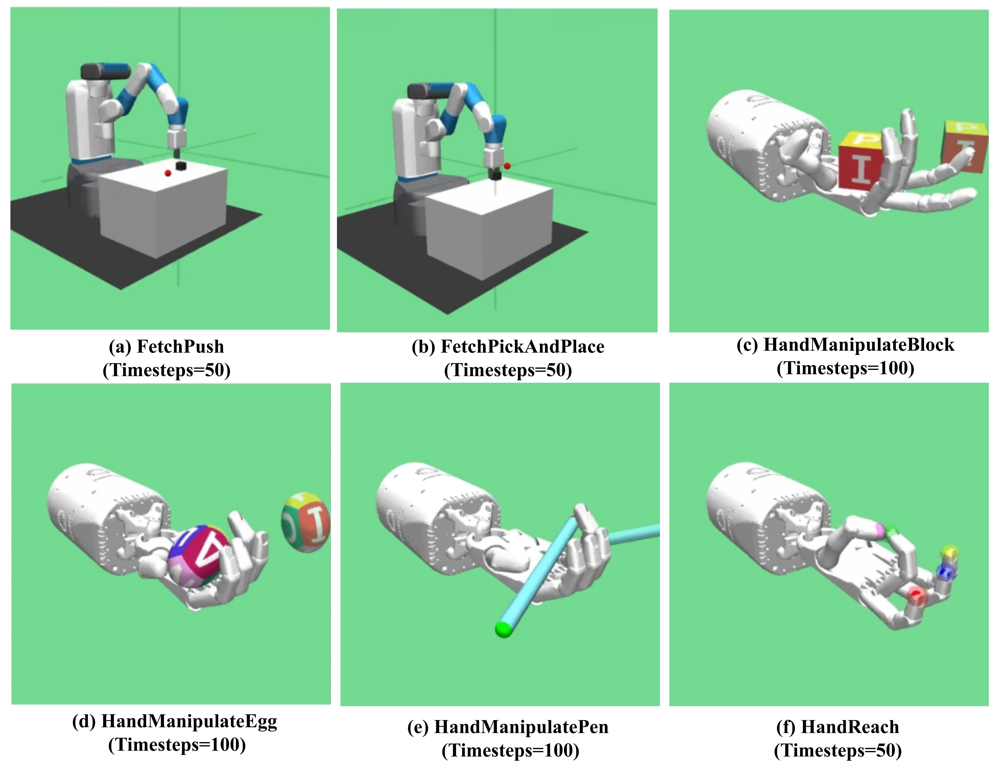
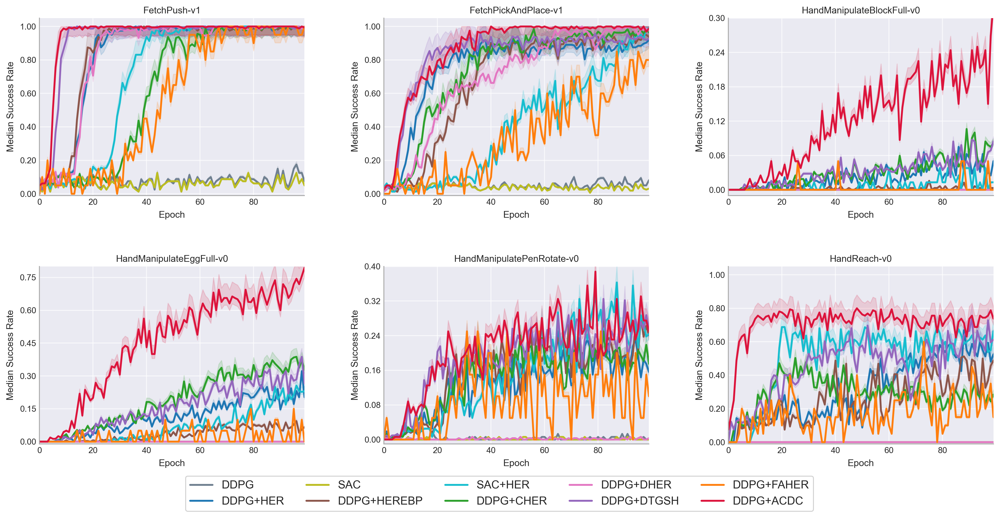
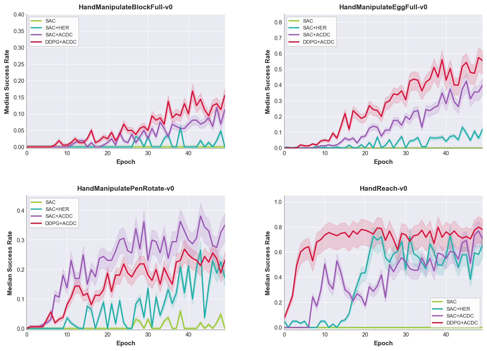

# ACDC: Adaptive Curriculum and Dynamic Contrastive Control for Goal-Conditioned Reinforcement Learning

## Requirements
- python=3.9.21
- openai-gym
- mujoco-py
- pytorch
- mpi4py
- mujoco210

## Instruction to run the code
If you want to use GPU, just add the flag `--cuda` **(Not Recommended, Better Use CPU)**.
If you only want to use GPU for LSTM in contrastive learning, just add the flag '--hybrid-gpu'**(Not Recommended, Better Use CPU)**.

## Environments

The environments are from OpenAI Gym. They are as follows:
- `FetchReach-v1`
- 'FetchPickAndPlace-v1'
- `HandReach-v0`
- `HandManipulateEggFull-v0`
- `HandManipulateBlockFull-v0`
- `HandManipulatePenRotate-v0`

## Code Structure
```text
ACDC
|-- DDPG_ACDC
|   |-- train.py
|   |-- demo.py
|   |-- ...
|-- SAC_ACDC
|   |-- train_sac.py
|   |-- ...

## How to train
1. train the **FetchPush-v1**:
```bash
mpirun -np 16 python -u train.py --env-name='FetchPush-v1' 2>&1 | tee push.log
```
2. train the **FetchPickAndPlace-v1**:
```bash
mpirun -np 16 python -u train.py --env-name='FetchPickAndPlace-v1' 2>&1 | tee pick.log
```
3. train the **HandManipulateBlockFull-v0**:
```bash
mpirun -np 16 python -u train.py --env-name='HandManipulateBlockFull-v0' --goal-type='full' 2>&1 | tee block.log
```
4. train the **HandManipulateEggFull-v0**:
```bash
mpirun -np 16 python -u train.py --env-name='HandManipulateEggFull-v0' --goal-type='full' 2>&1 | tee egg.log
```
5. train the **HandManipulatePenRotate-v0**:
```bash
mpirun -np 16 python -u train.py --env-name='HandManipulatePenRotate-v0' --goal-type='rotate' 2>&1 | tee pen.log
```
6. train the **HandReach-v0**:
```bash
mpirun -np 16 python -u train.py --env-name='HandReach-v0' --goal-type='full' 2>&1 | tee reach.log
```
### Play Demo
```bash
python DDPG_ACDC/demo.py --env-name=<environment name>
```

## Results
### Training Performance in DDPG + ACDC
It was plotted by using 5 different seeds, the solid line is the median value. 


### Training Performance in SAC + ACDC
It was plotted by using 5 different seeds, the solid line is the median value. 


### Demo:
**Tips**: when you watch the demo, you can press **TAB** to switch the camera in the mujoco.

## Other Baselines
If you want to run other baseline algorithms for comparison, please refer to the following excellent repositories:
- [CHER / HEREBP / HER](https://github.com/mengf1/CHER?tab=readme-ov-file)
- [DTGSH (Diversity-based HER)](https://github.com/TianhongDai/div-hindsight)
- [FAHER (Clustering-based HER)](https://github.com/ngng9957/Clustering-based-Failed-Goal-Aware-Hindsight-Experience-Replay.git)
